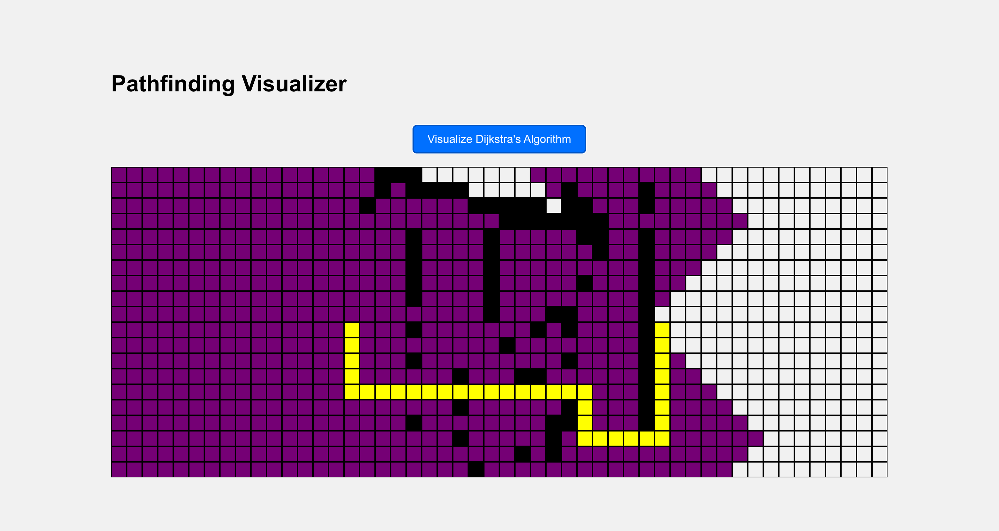

# Dijkstra's Pathfinding Algorithm Visualizer

This project is a visualization tool for Dijkstra's Pathfinding Algorithm built with React. It allows you to visualize the working of Dijkstra's algorithm in an interactive way. 

You can create walls by clicking and dragging across the grid, and then click the "Visualize Dijkstra's Algorithm" button to see the shortest path from the start node to the end node.



## Getting Started

These instructions will get you a copy of the project up and running on your local machine for development and testing purposes.

### Prerequisites

Make sure you have Node.js and npm installed on your machine.

### Installing

1. Clone the repository:
    ```
    git clone git@github.com:ibraheem-latif/Pathfinder.git
    ```
2. Navigate into the cloned repository:
    ```
    cd Pathfinder
    ```
3. Install the dependencies:
    ```
    npm install
    ```
4. Start the development server:
    ```
    npm start
    ```

Now, the app should be running on [http://localhost:3000](http://localhost:3000).

## Built With

- [React](https://reactjs.org/)

## Authors

- **Ibraheem Latif**


